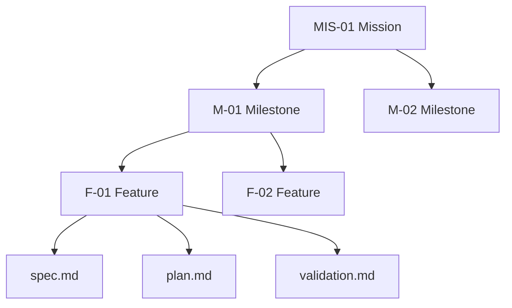
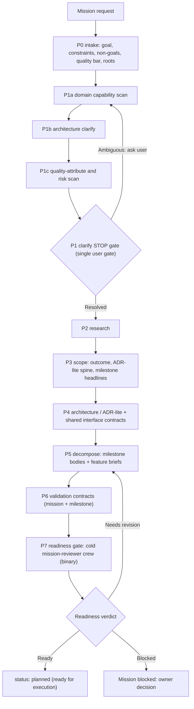
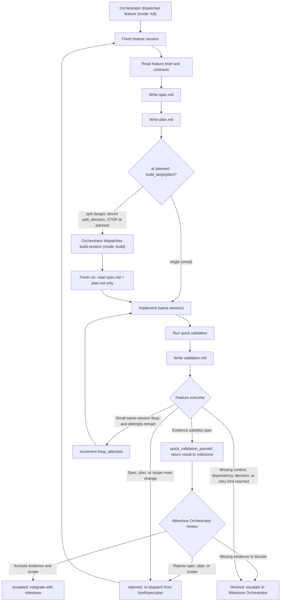
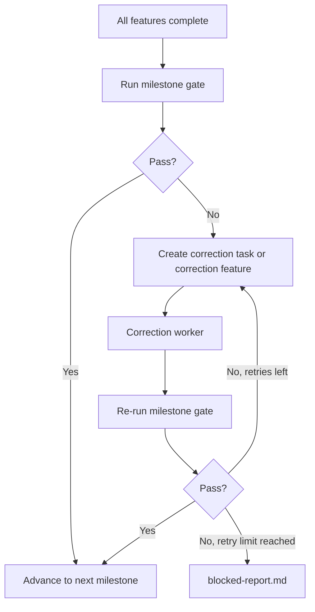
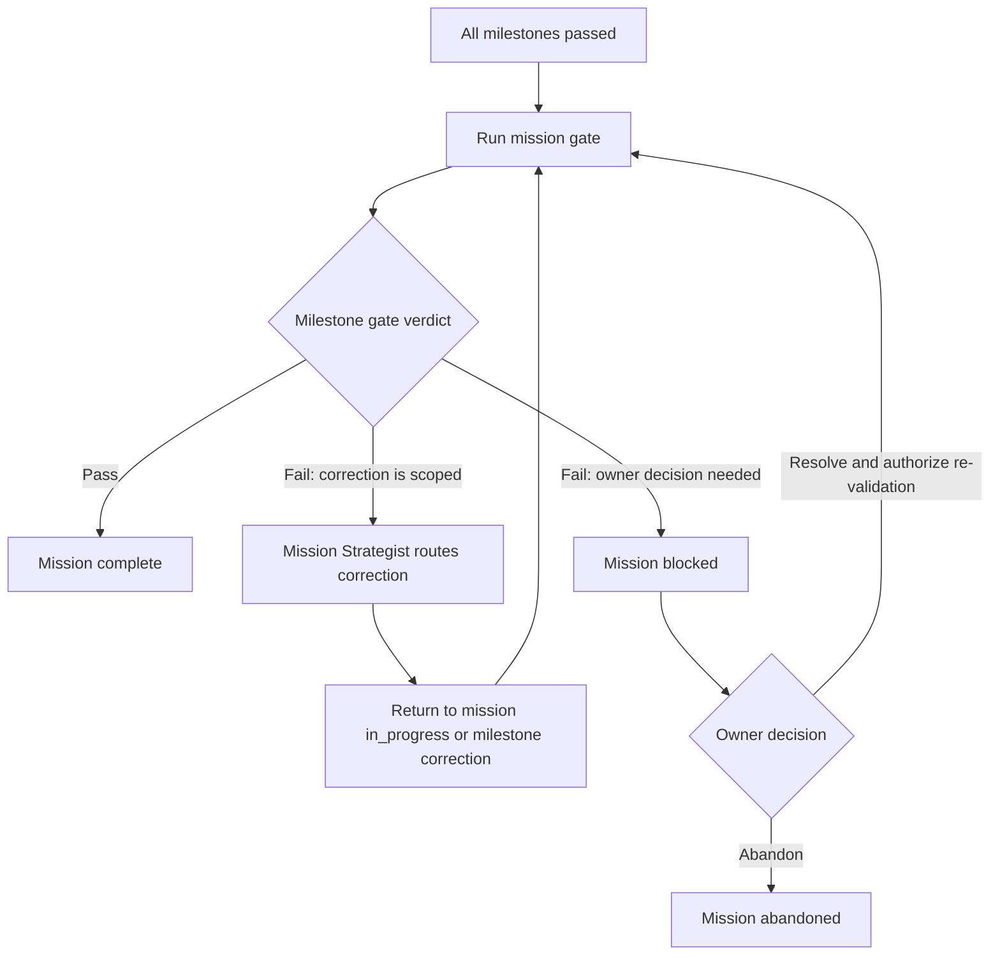
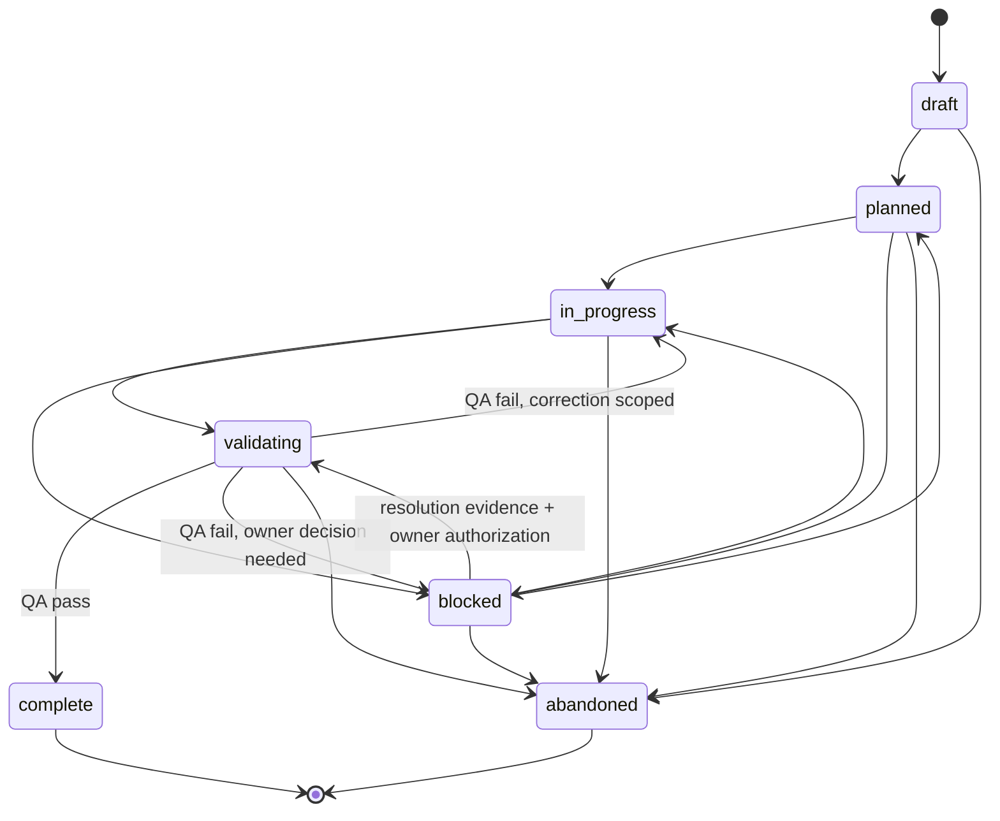
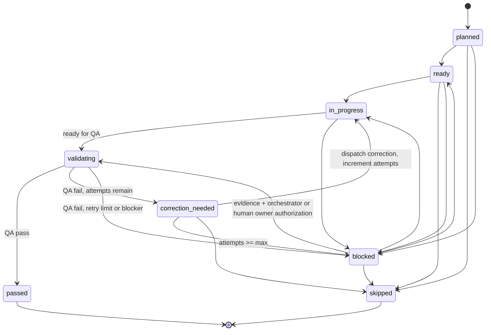
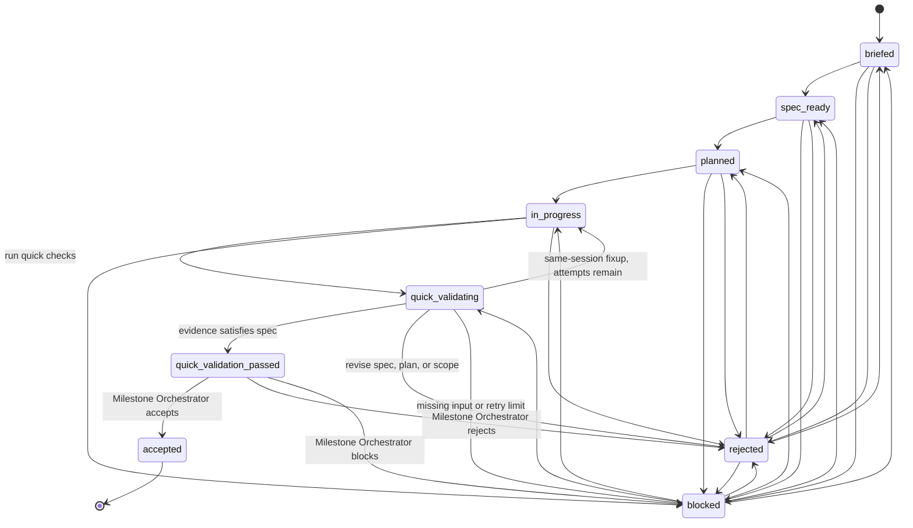

# MNFS Workflow Diagrams

## Topology

## Mission Planning

## Feature Execution Loop

## Milestone Validation And Correction

## Mission Completion

## Lifecycle State: Mission

## Lifecycle State: Milestone

## Lifecycle State: Feature

