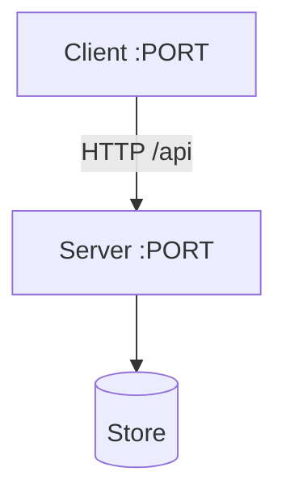
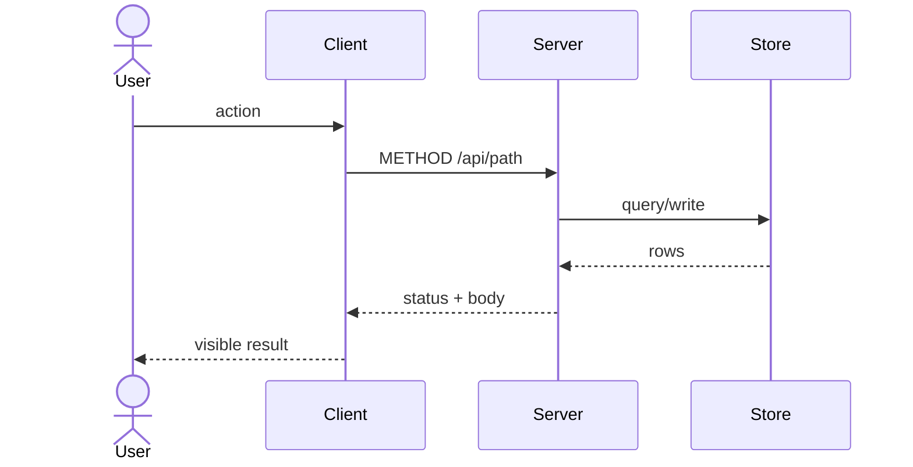
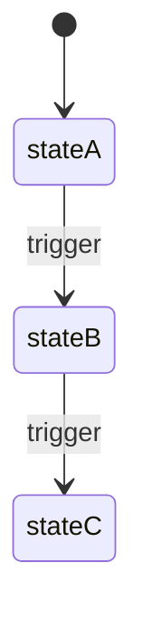
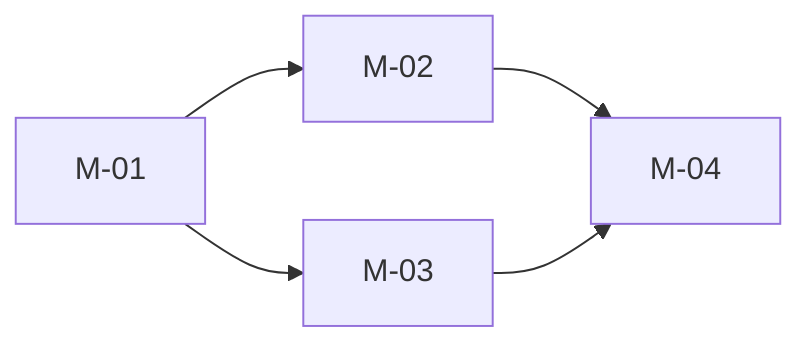

# Architecture Map Card

Use only when the mission meets the diagram trigger. Target path: `<mission-root>/architecture-map.md`.

A view of the contracts — never a parallel source of truth. Interface contracts + ADRs + runtime topology stay authoritative; this file visualizes them.

## Trigger (create the artifact iff ≥1 holds)

1. Two or more runtime surfaces communicate across a seam (client / server / store).
2. A stateful lifecycle has three or more states/transitions.
3. Milestone or feature dependency order is non-linear (parallel tracks or fan-out).

Single-surface, linear, stateless missions skip this artifact — no decoration.

## Views (include only those that apply)

### Topology (trigger 1) — `graph TD`

### Behavior flow (request/response crosses a seam) — `sequenceDiagram`

### Lifecycle (trigger 2) — `stateDiagram-v2`

### Build order (trigger 3) — `graph LR`

## Truthfulness rules

- Node/edge labels must match interface-contract operation names, ports, and route prefixes.
- State nodes must match the IC enum exactly.
- Build-order edges must match milestone dependencies.
- mission.md's architecture section links here; execution never reads this file for semantics.
- The reviewer checks this map under ★2 Consistency; drift is a defect.
